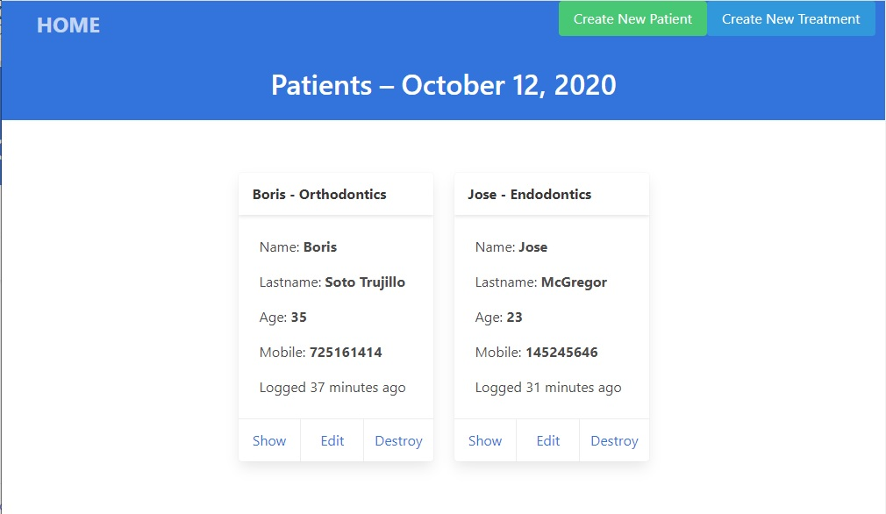
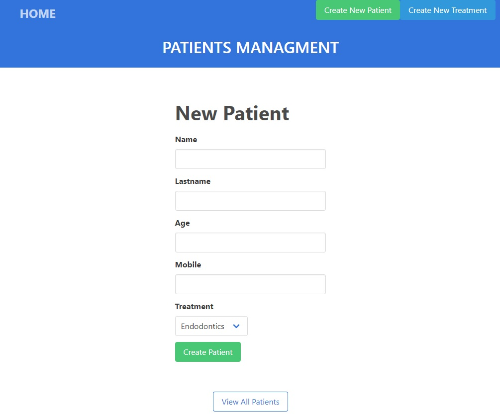
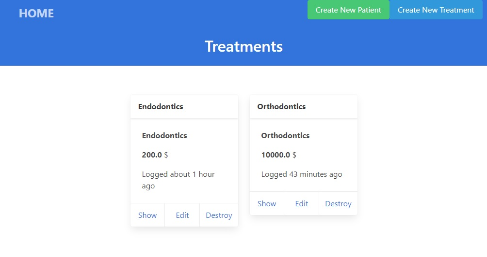

# README

Steps are necessary to get the
application up and running.

- Styles: BULMA CSS

Things you may want to cover:

- Rails version 6

Deployment instructions

- run "git clone"

- run "bundle install" in command

- run "rails db:migrate"

- in browser type "localhost:3000"

- Create Treatment

- Create Patient

- Screenshots

